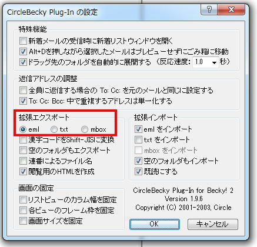
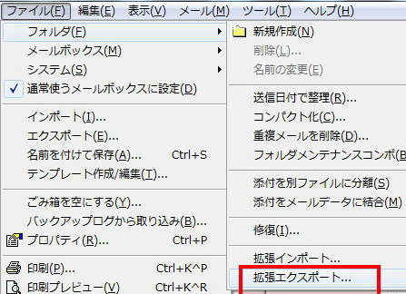

# Becky2 から Thunderbird への移行手続き

- POP3　で運用されているサーバでは過去のメールメッセージデータが移行されません。
- IMAP4　運用サーバに切り替えられるまでは以下手順で対応します。

## 対象の[MUA](https://ja.wikipedia.org/wiki/%E9%9B%BB%E5%AD%90%E3%83%A1%E3%83%BC%E3%83%AB%E3%82%AF%E3%83%A9%E3%82%A4%E3%82%A2%E3%83%B3%E3%83%88 "電子メールクライアント")
* [Becky2](https://www.rimarts.co.jp/becky-j.htm "Becky2")
* [Thunderbird](https://www.thunderbird.net/ja/ "Thunderbird")

## 手順
基本的に新しいPCに移し替えるという流れになるので、移行先は外付けストレージ、ネットワーク共有（NAS)をおすすめします。

1. CircleBecky というプラグインをインストール手順があります。

必要なもの：　同上プラグイン、エクスポート先フォルダ（物理的に余裕があるもの）

* 長年使っているPCでBeckyを動かしていて、HDD容量が心もとない場合は、エクスポート先フォルダをUSB接続のストレージ、NASなどに準備しておきましょう。 
* Becky!プラグイン [CircleBecky](http://www.vector.co.jp/soft/dl/win95/net/se252604.html "CircleBecky")  をインストールします。
* ツール→プラグインの設定→"CircleBecky Plug-in" でインストール/確認
{: .center}
* ファイル → フォルダ → 拡張エクスポート →　エクスポート先のフォルダを選んでOK。
{: .center}
* 移行先PCに Thunderbirdをインストール、POP3アカウント設定までは進めておきます。
* Thuderbird を起動　「ツール」→「アドオン」を開きます。
* アドオン　MBoxImport をインストールします。
* 移行先PCで「エクスポート先のフォルダ」が参照できるようにしておきます。
* Thuderbird に　「エクスポート先のフォルダ」からメールメッセージをインポートします。
- a) 受信トレイを選択します。
- b) 右クリック →　「インポート・エクスポート」→「ファイルから全てのemlファイルをインポート」→「サブフォルダを含む」
 
以上です。

## 備考

* Thunderbird は 寄付によって維持されています。
* 私(strnh)も微力ながら寄付しています。
* プロジェクトの存続を望むのであれば、彼らに寄付しましょう。

* [Thunderbirdプロジェクトへの寄付](https://www.thunderbird.net/ja/donate/ "donation")

